# Практическая работа №3: Системы контроля версий Git (Ветки и Разрешение конфликтов)

## Выполнил: [Абубакиров Артур]

### Шаг 1. Настройка Git и авторизации по SSH на GitHub
- В виртуальной машине заданы глобальные параметры автора: `user.name` и `user.email`.
- Сгенерирована пара SSH-ключей алгоритма `ed25519` командой `ssh-keygen`.
- Публичный ключ добавлен в настройки профиля GitHub (*Settings -> SSH and GPG keys*).
- Выполнено успешное тестирование соединения с сервером GitHub: `ssh -T git@github.com`.

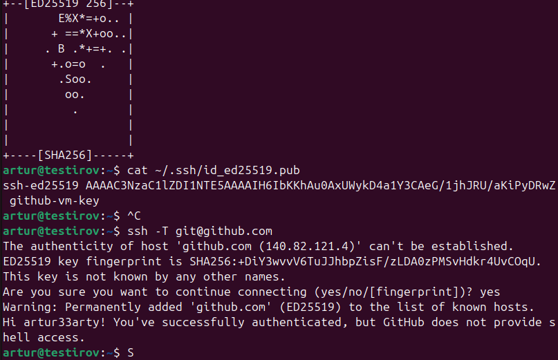
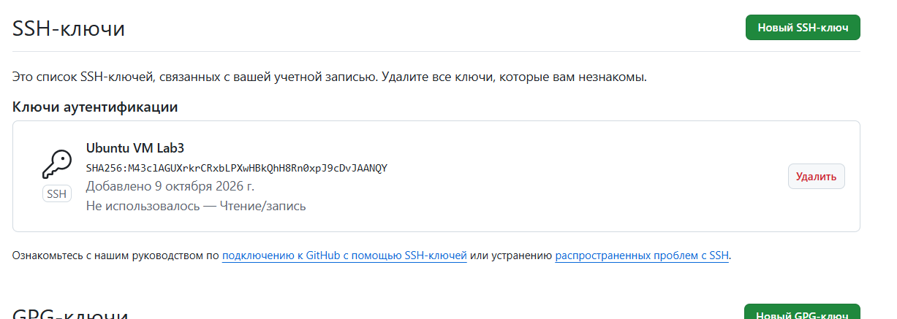

### Шаг 2. Создание локального репозитория и первая публикация (Push)
- На GitHub создан пустой репозиторий `devops_lab3` без предварительной инициализации файлов.
- В виртуальной машине создан каталог `~/devops_lab3`, инициализирован локальный репозиторий: `git init`.
- Создан первичный файл `README.md`, изменения зафиксированы коммитом: `git commit -m "README"`.
- Локальный репозиторий связан с удаленным через SSH (`git remote add origin git@github.com:...`).
- Выполнена отправка коммита на сервер в ветку `master`: `git push -u origin master`.

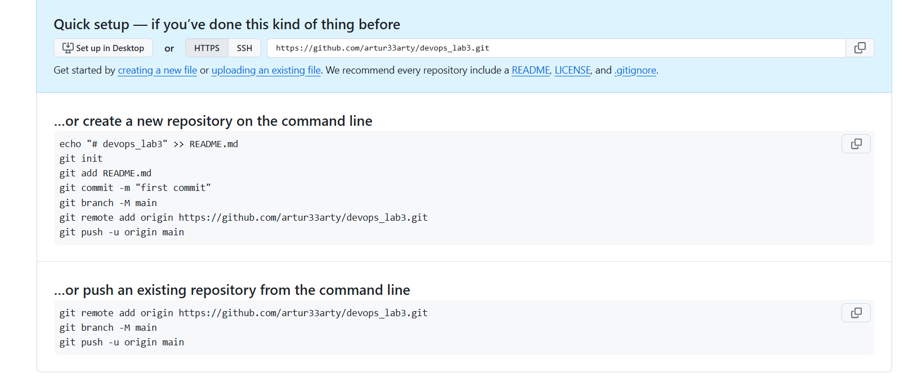
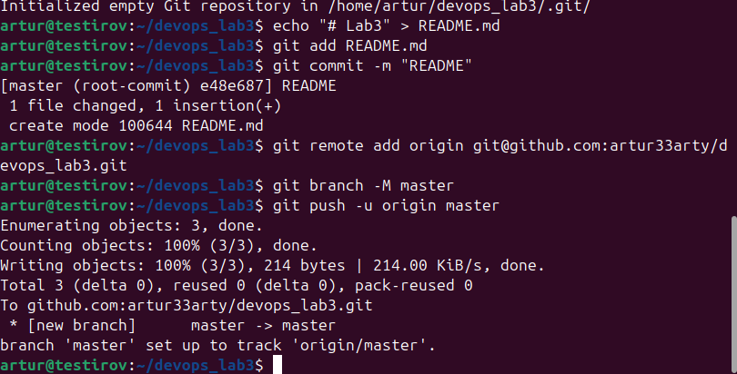
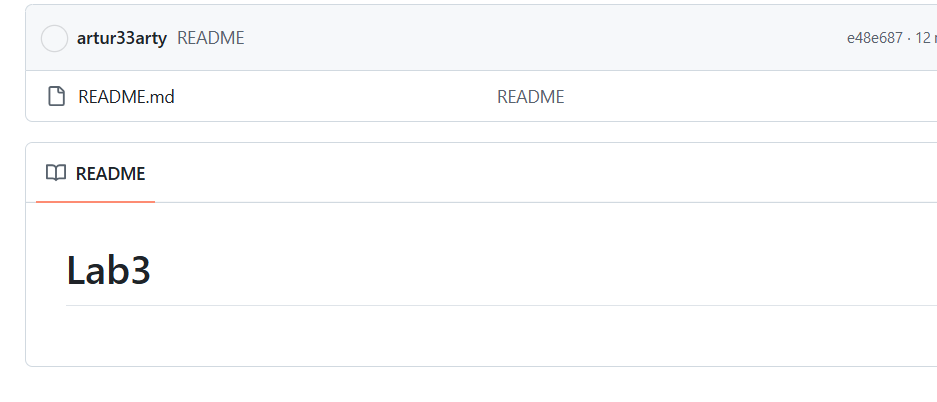

### Шаг 3. Моделирование и разрешение конфликта слияния (Merge Conflict)
- Смоделирована параллельная работа двух разработчиков: внесены и зафиксированы изменения в файл `README.md` локально в ВМ (`local hello`) и удаленно через веб-интерфейс GitHub (`remote world`).
- При попытке выполнить `git push` зафиксирован отказ сервера (`rejected / non-fast-forward`).
- Выполнена операция синхронизации `git pull`, в результате которой зафиксирован конфликт слияния (`CONFLICT (content)`).
- Проанализировано состояние репозитория через `git status` (`both modified: README.md`).
- В текстовом редакторе вручную удалены маркеры конфликта (`<<<<<<<`, `=======`, `>>>>>>>`), сформирована компромиссная версия текста: `Hello, Local and Remote Worlds!`.
- Изменения добавлены в индекс (`git add README.md`), зафиксирован коммит слияния и выполнен успешный `git push`.

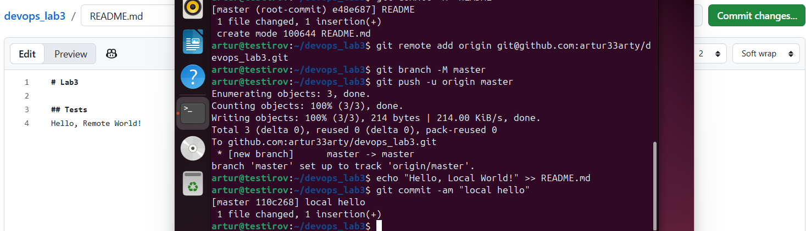
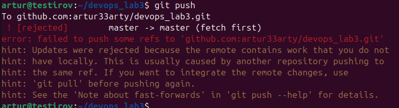
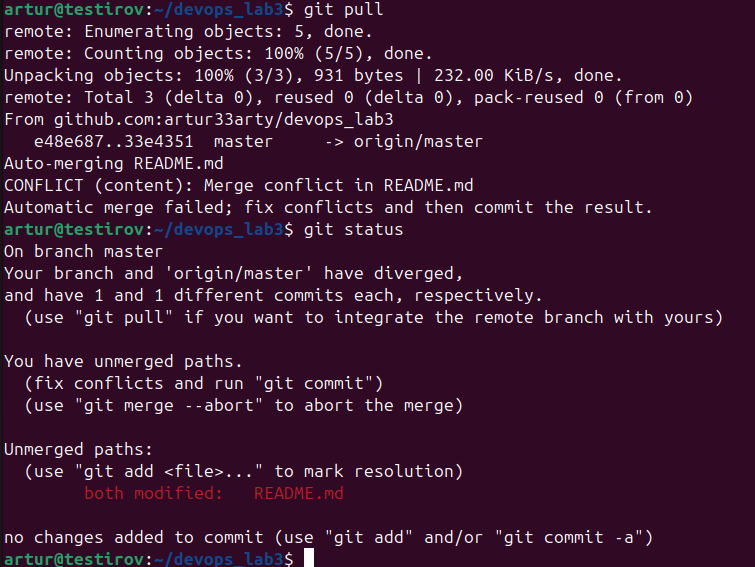
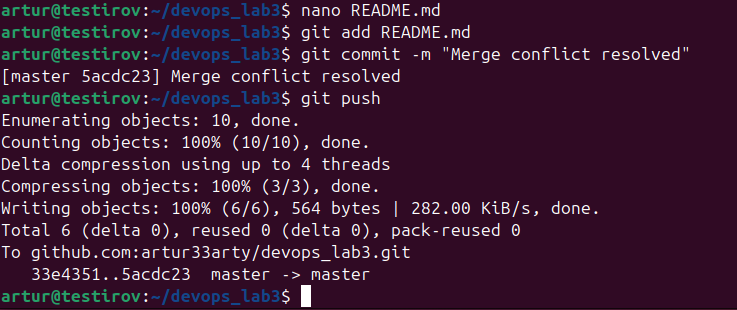
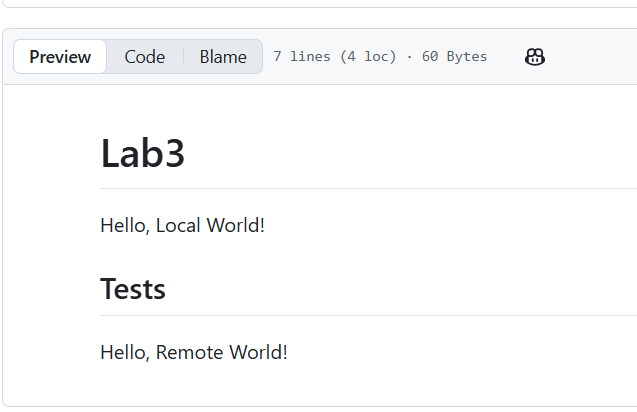

### Шаг 4. Работа с ветками (Branching) и слияние (Merge)
- Создана новая изолированная ветка функционала и выполнен переход в неё: `git checkout -b FEAT-123`.
- В файл `README.md` внесены изменения и зафиксированы коммитом: `git commit -am "feat: 123"`.
- Новая ветка отправлена на удаленный сервер GitHub с включением отслеживания: `git push -u origin FEAT-123`.
- Наличие ветки и её содержимое проверены в веб-интерфейсе GitHub.
- Выполнен возврат в основную ветку (`git checkout master`), изменения из ветки `FEAT-123` успешно влиты в `master` командой `git merge FEAT-123`.
- Итоговая версия основной ветки отправлена на сервер: `git push`.

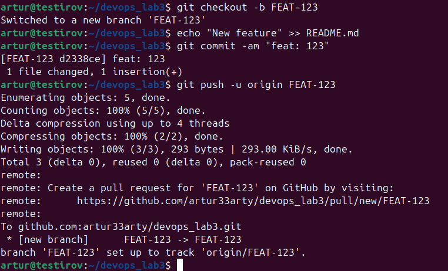
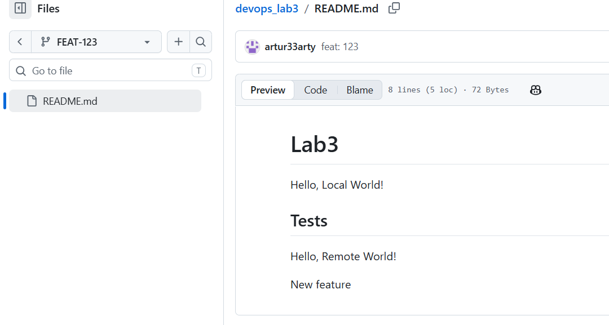
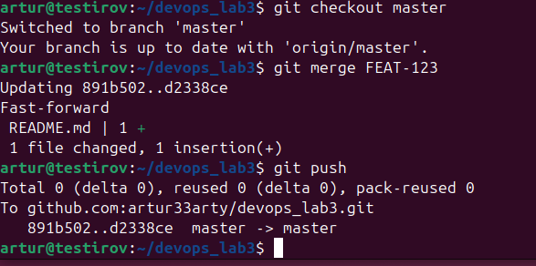
